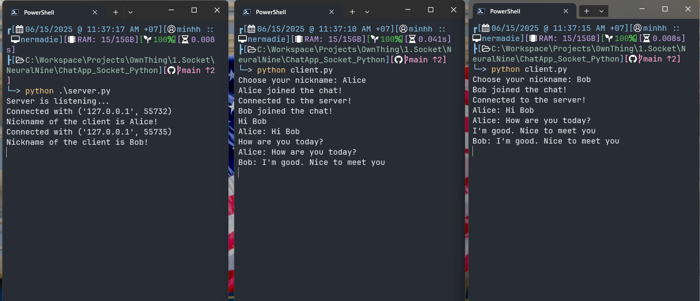

# Python Chat Application (Socket Programming)

A simple console-based chat application built with Python using socket and threading modules. It includes both a server and a client script, allowing multiple clients to join and exchange messages in real-time.

---

## 🧠 Features


- Multiple clients can connect to the server simultaneously.
- Real-time message broadcasting to all connected clients.
- Nickname identification for each user.
- Graceful client disconnection handling.
- Console-based interaction (lightweight, easy to test).

---

## 📁 Project Structure

```bash
.
├── client.py       # Client-side chat program
└── server.py       # Server-side chat manager
```

---

## 🚀 Getting Started

### Prerequisites

- Python 3.6 or higher
- No external libraries required

### 1. Start the Server

```bash
python server.py
```

You should see:
```
Server is listening...
```

### 2. Start the Client(s)

In a separate terminal (or multiple), run:

```bash
python client.py
```

You'll be prompted:
```
Choose your nickname:
```

After entering your nickname, you can begin chatting.

---

## 🧩 How It Works

### Server (`server.py`):

- Listens for incoming TCP connections.
- Asks each client for a nickname.
- Maintains lists of connected clients and their nicknames.
- Spawns a new thread to handle each client’s messages.
- Broadcasts messages to all connected clients.
- Handles disconnection and notifies others.

### Client (`client.py`):

- Connects to the server.
- Sends nickname on request.
- Starts two threads:
  - One to receive and print messages from the server.
  - One to read user input and send messages.

---

## 📦 Example Output

**Client A:**
```
Choose your nickname: Alice
Bob joined the chat!
Alice: Hello everyone!
```

**Client B:**
```
Choose your nickname: Bob
Alice joined the chat!
Alice: Hello everyone!
Bob: Hi Alice!
```
---

## ⚠️ Limitations & Notes

- This is a basic implementation and doesn't include encryption or authentication.
- Not suitable for production use without enhancements like:
  - Input validation
  - Connection timeouts
  - Secure sockets (SSL/TLS)

---

## 🛠️ Future Improvements

- GUI support (Tkinter, PyQt)
- Message formatting (timestamps, emojis)
- File sharing support
- Encrypted communication (TLS)
- WebSocket version for browser-based chat

---

## 📄 License

This project is open-source and free to use for educational and personal purposes.

---

## 👨‍💻 Author

Created by **Nhật Minh Trần** – feel free to use, modify, and expand it!
